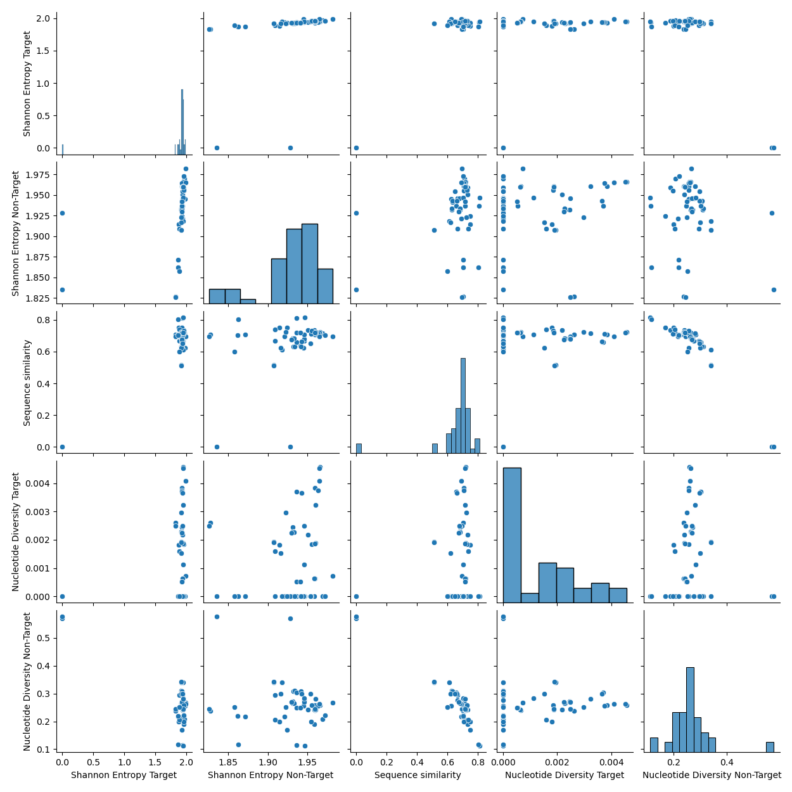
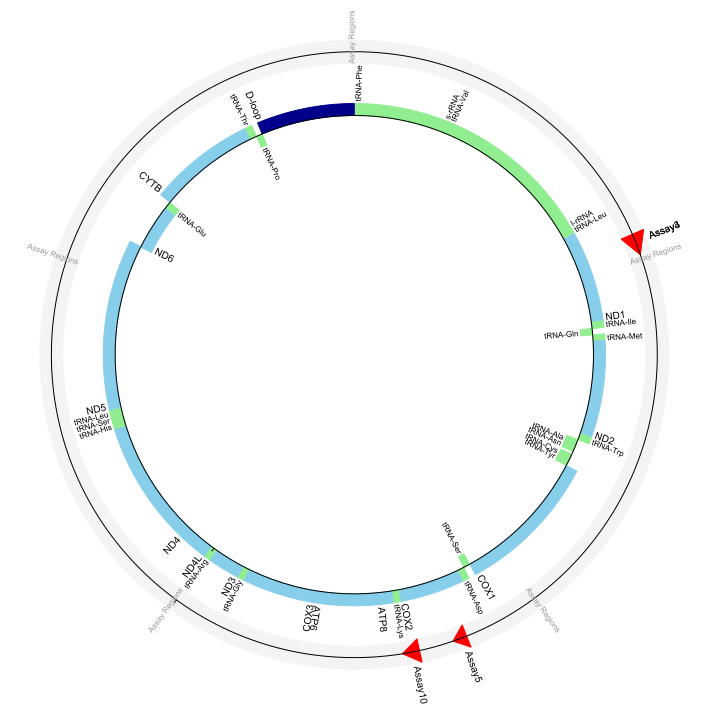

# assayID


## assayID

A quick and efficient tool for automating the design of optimized species-specific qPCR/ddPCR assays. 
* **assay_design_env.yml**: Use to create a conda environment containing all necessary dependencies.
* **config.ini**: configuration file, user alters parameters in this file.
* **Align_ClassifyTaxon.py**: aligns and scans full mitochondrial sequence files to find optimal windows for assay design. Designs assays and ranks based on target species sensitivity and specificity.

[Primer3web](https://primer3.ut.ee/) and [Primer3Plus](https://www.primer3plus.com/) are widely used web-based tools for the *in silico* design of primer-probe assays for qPCR and ddPCR. The user can specify a sequence template for a given target species, and the programs will design an assay for that region, optimized to reduce secondary structure formation. However the choice of region to use for assay design can be a challenging one, particularly when one wants to robustly indentify the presence or quantity of target-species DNA in an environmental DNA (eDNA) sample. The ideal stretch of sequence will exhibit both sensitivity (low genetic diversity among target-species sequences), and specificity (high genetic distance between target and non-target sequences). However visually identifying sequence regions that satisfy such criteria in very large alignment files is a difficult, time consuming, and inherently subjective task. \
\
assayID was created to address this problem. It provides a fast and efficient, robust method for species-specific assay design. The emphasis has been on creating a user-friendly tool with **almost no coding knowledge required to use it!** \
\
Simply download the files, edit the configuration file, and run the python script. Depending on user-specified parameters in that file, the program will:
- Use clustal omega to align a fasta file containing full mitochondrial genomes from a range of target and non-target species. Ideally, there should be more than one sequence representing your target species. If an alignment file already exists, the program will skip this step and use that alignment file as input instead.
- Scan the alignment file and identify all possible windows across a range of window sizes.
- Use Primer3 to design primer-probe assays for the consensus sequence of target species sequences in each window.
- Identify the regions covered by the designed assays and calculates a range of diversity and distance metrics for each region. This includes measures of target species genetic diversity and distance measures between target and non-target sequences (e.g. Shannon Entropy, sequence similarity, nucleotide divergence).
- The designed assays are then ranked accoring to their specificity and sensitivity. An ideal assay will target a region that has a combination of a low genetic diversity for the target species seqeunces, and high genetic distance to non-target species sequences. A multivariate statistic method: Technique for Order of Preference by Similarity to Ideal Solution (TOPSIS) is used to rank designed assays and identify those with the optimal balance of specificity and sensitivity.
- The output will include an excel file containing ranked assays, saved to your working directory. The user can use these primer-probe sets as a basis for further ^in silico* analysis (for instance in primerBLAST or OligoAnalyzer) and for use as qPCR and dPCR assays. A pairwise plot showing the various statistics calculaated for all assays is also outputted, together with a simple diagram of a circular mt-genome showing the locations of the top 10 ranked assays.






## Author
James McKenna (james.andrew.mckenna@hi.no) \
https://github.com/jammc313/assayID

## Dependencies
* Python 3.11
* primer3
* biopython
* configparser
* reportlab

## Getting started
* Create the environment: Run the following command to create a Conda environment using the downloaded YAML file:
```
conda env create -f assay_design_env.yml
```
* Activate the new environment: 
```
conda activate assay_design_env
```
* Edit the parameters in the config.ini file. This includes specifying your target species, the path to your (aligned or unaligned) fasta file containing full mitochondrial sequences downlaoded from public repositories such as ncbi or genbank.
* Run the script!   
```
python Align_ClassifyTaxon.py
```
